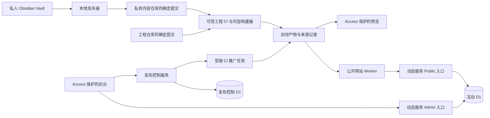

# Keronshans 平台重建协作技术规范

> 2026-10-06：本文件保留为长期设计；v1 实际发行范围由 [ADR 0004](adr/0004-release-v1-scope.md) 收敛，当前状态见 [IMPLEMENTATION-STATUS](IMPLEMENTATION-STATUS.md)。

> 版本：0.1 · 日期：2026-10-03 · 状态：设计基线；部分 G0/G1/G4 已在本地实施
> 适用对象：项目所有者、开发协作者、自动化编码代理。
> 用户已确定：选择完整平台化重建；Obsidian / 本地 Markdown 为主要写作入口，网页后台负责发布和互动管理。

本文定义目标架构、操作链路、接口契约、迁移与验收。除“当前基线”外，本文的目录、命令、接口、域名和安全控制均是拟实现规范，不能当作已经上线的能力。本次编写文档不代表完成重构、配置云服务、创建仓库或授权实际生产发布。

当前实现与本规范的逐项证据见 [IMPLEMENTATION-STATUS.md](IMPLEMENTATION-STATUS.md)。该审查表没有把本地测试或代码存在误判为 Access、Cloudflare、GitHub App、生产 D1 或生产部署已经完成。

与旧 README、PROJECT_MAP、CONTENT-PUBLISHING 中的未来规划冲突时，以本文为目标设计基线；判断当前程序实际行为时，以第 2 节及当前实现为准。

“必须 / 禁止”表示验收要求；“建议”表示可经评审调整；“示例”中的占位值不得直接用于部署。调整本规范涉及的内容身份、权限、发布一致性或数据归属时，先记录架构决策，再修改实现。

阅读入口：

- 架构与数据：[模块边界](#3-仓库模块与运行边界)、[内容契约](#5-内容格式契约schemaversion-1)。
- 日常操作：[安全导出](#6-安全导出链路)、[完整发布链路](#8-端到端日常操作)。
- 精确实现：[状态与接口](#9-发布状态接口与并发)、[CI 与产物](#10-ci产物与环境)、[安全](#11-管理安全与服务身份)。
- 协作推进：[迁移阶段](#15-迁移步骤与退出条件)、[验收矩阵](#16-验收矩阵)、[分工](#17-协作分工与变更规则)。

## 1. 目标、边界与关键决策

第一版交付：一个站点、一位作者、一套完整主题、一条可验证和可回滚的发布链路。架构允许将来扩展多人、多主题和多站点；第一版不提供多人协同编辑、双向笔记同步、运行时任意主题插件或公开主题上传。

| 编号 | 决策 | 理由与约束 |
| --- | --- | --- |
| ADR-001 | Obsidian 是文章和代码模板的权威编辑源 | 导出的内容仓库不接受后台直接编辑；避免下一次导出覆盖远程修改 |
| ADR-002 | 一个工程 monorepo + 一个独立的私有内容 Git 仓库 | 代码共享方便；未上线内容、历史撤稿也不会因为 Git 仓库公开而暴露 |
| ADR-003 | 网站、后台、动态服务、发布控制分别部署 | 通过运行权限隔离；仅分目录或隐藏菜单不足以隔离 |
| ADR-004 | 第一版继续采用 Next.js / OpenNext / Cloudflare | 复用现有基础；依赖升级单独验证兼容性，架构重构不强制同时换框架 |
| ADR-005 | 文章在构建期生成快照，线上不按请求读取私人 Vault 或拉取 Git | 页面、目录、全文搜索和资源属于同一快照 |
| ADR-006 | 内容身份 ID 永久稳定，slug 单独管理 | 文件改名不影响评论与点赞；地址改动通过明确别名重定向 |
| ADR-007 | 构建产物封存后再预览与推广 | 预览通过的产物就是申请上线的产物；生产推广不重新构建 |
| ADR-008 | D1 保留动态业务数据，停止作为文章/模板正文的第二写入源 | 删除环境相关的数据源猜测和静默回退 |
| ADR-009 | 主题以工程内独立包维护，构建时选择 | 第一版只有一套主题和明暗模式；第二套用于验证接口，暂不发布 npm 包 |
| ADR-010 | 发布权限集中在受限 CI 与发布控制服务 | 公开网站、浏览器、桌面渲染进程不持有 GitHub App 私钥或 Cloudflare 部署 Token |

后台“管理发布”指管理候选版本、预览、推广、回滚和故障；“管理互动”指评论审核、说说、打卡和题单等动态记录。文章元数据也属于 Obsidian 权威源，后台不能单独修改标题、置顶和分类。

## 2. 当前基线与需要保留的行为

基线来自 2026-10-03 当前工作目录；Git HEAD 为 `3c25264dd5019d9385a75c8094cb790fc496eb4e`，分支为 `codex/firefly-search-manager`。工作目录存在大量未提交变更，因此该 HEAD **不能单独代表此次评估的文件内容**。实施第一个任务前必须制作包含这些变更的可恢复快照。

| 范围 | 当前事实 | 目标处理 |
| --- | --- | --- |
| 文章 | 本地 33 篇、模板 3 个；本地文章生成 ID 未发现重复；尚未盘点生产 D1 独有记录 | 对本地、D1、实际线上 URL 联合盘点，不能只迁移这 33 篇 |
| 内容读取 | `src/lib/posts.ts`、snippets API 和搜索已只读当前构建的 Markdown 快照；后台正文写入 API 返回 `405 CONTENT_SOURCE_READONLY`。历史 D1 正文表仍在，生产独有内容尚未对账 | 完成 D1 独有正文对账与归档后，才允许切换真实生产内容仓库 |
| 发布器 | 已要求 `Published/` 固定边界；draft 不进入 registry/manifest；使用旁路候选和源 hash 二次复核；撤稿需要确认摘要 | 继续补齐真实内容仓库的双机 fast-forward 演练和生产审计 |
| 模板 API | 当前接口按登记 ID/白名单读取并显式 DTO 返回；仍需真实服务入口演练 | 在隔离服务中验证 400/404、越界路径和审计输出 |
| 内容资源 | AST 图片引用闭包、资源白名单、draft 排除和常见格式文件签名已在本地 publisher 实现 | 增加 EXIF 敏感元数据检查和真实资源样本验收 |
| 样式 | Nightowl 注册表、语义 token 和主题组件已接入首页/文章目录；旧 CSS 仍有历史层 | 完成全尺寸可访问性矩阵并清理无主旧样式 |
| 安全 | 已有独立 HMAC 密钥、HttpOnly / Secure / SameSite Cookie；限流是实例内 Map | Access 身份验证、统一权限和输入约束、共享限流、审计 |
| 发布 | 本地 publisher 已支持 expected parent、fast-forward 前检查和 immutable 搜索摘要；CI/Cloudflare 仍未形成真实 release-controller | 唯一生产发布入口、固定输入 SHA、发布与搜索同版本 |
| 校验 | 前一轮已通过管理器 6 项、搜索 8 项测试，以及 TypeScript / ESLint | 作为已有基线，不代表发布、鉴权和迁移已被覆盖 |
| 依赖 | 前一轮生产依赖审计为 high 1 / moderate 1，涉及 PostCSS / Next 依赖链 | 在锁定工具链时重新审计并验证修复，不能据旧报告声称当前线上安全 |

证据入口：

- [内容读取](../src/lib/posts.ts)、[旧 URL 生成](../src/lib/postSlug.ts)、[模板读取](../src/lib/snippets.ts)。
- [发布器](../scripts/publish-content.cjs)、[工作流](../.github/workflows/deploy.yml)、[本地部署](../deploy.ps1)。
- [OpenNext 缓存配置](../open-next.config.ts)、[站点检查](../scripts/check-site.cjs)。
- [会话实现](../src/lib/adminPassword.ts)、[限流](../src/lib/rateLimit.ts)、[Markdown 渲染](../src/components/MarkdownRenderer.tsx)。
- [旧内容迁移文档](CONTENT-PUBLISHING.md)、[历史安全报告](../SECURITY-AUDIT-2026-09-05.md)。历史报告的时间和修复状态不能替代本次上线检查。

上述风险的验证使用本地源码和合成临时文件，没有读取真实私有笔记，也没有在公网尝试越界读取。本轮规范不宣称已经复核生产 Secret、Access 配置或生产 D1。

## 3. 仓库、模块与运行边界

### 3.1 目录

```text
Keronshans-Notes/                   # 私人 Vault，工程外独立备份
  Private/
  Published/
    site.json                      # 可公开站点配置
    posts/**/*.md
    snippets/**/*.md
    assets/**                      # 显式允许发布的图片

blog-content/                      # 独立私有 Git 仓库，导出物
  site.json
  posts/**/*.md
  snippets/**/*.md
  assets/**
  content-registry.json             # 发布器维护的身份、别名和撤稿记录
  content-manifest.json

blog-platform/                     # 此仓库逐步迁移成为该结构
  apps/
    web/                           # Next.js 公开站点
    admin/                         # 独立后台
    services/                      # 动态数据 Worker，能力分离的入口
    release-controller/            # 发布请求、状态、OIDC、串行控制
  packages/
    content-schema/                # 纯类型、校验、迁移版本
    content-build/                 # Markdown / 资源 / 路由 / 搜索生成
    content-runtime/               # 读取已生成快照，无 fs/Git/D1 回退
    ui/                            # 无业务数据访问的基础组件
    themes/
      editorial/                   # 第一套完整主题，名称可设计评审后调整
  tooling/
    publisher/                     # Vault 导出 CLI
    migration/                     # 一次性盘点与迁移工具
  infra/
    cloudflare/                    # 按环境拆分 bindings 和 routes
    migrations/                    # 有序、可校验的数据库迁移
  docs/
    adr/
    runbooks/
```

使用 npm workspaces 和单一工程 lockfile；每个应用独立构建/部署。第一版不引入 Nx/Turborepo 等额外编排工具；确有缓存或编排瓶颈时另行决策。内容仓库无 package.json、无执行脚本、无主题代码。

网站的简介、导航顺序等展示配置可以进入 `site.json`，但只允许白名单字段和站内地址/https URL。域名绑定、数据库标识、部署目标、身份策略、Secret 和可执行插件只允许出现在受控工程配置或云服务配置中。

site.json v1 必填 schemaVersion: 1、siteId: "keronshans"、title（1–80 码点）、description（0–240 码点）、author.name（1–80 码点）；可选 author.avatar（assets 引用）、navigation（最多 12 个 {label,href}）和 socialLinks（最多 8 个 {label,href}）。label 为 1–30 码点，href 使用第 5.3 节协议规则；拒绝未知字段。主题选择属于工程/发布配置，不由内容文件执行动态 import。

### 3.2 依赖方向



- `content-schema` 不依赖 React、Next、Cloudflare 或文件系统。
- `content-build` 可依赖 Node 和 Markdown 工具，不读取生产 D1/私人 Vault。
- `web` 和主题只消费规范化数据；不能导入 publisher、Git 客户端、D1 文章读取器。
- `ui/themes` 不定义分类兼容规则，不读取数据库，不发起部署。
- `services` 对外只通过 DTO 返回显式字段；禁止 SELECT * 的结果直接作为公开响应。
- `release-controller` 使用单独控制库，管理互动库的迁移不应破坏发布状态记录。

### 3.3 权限分离

| 执行方 | 可用能力 | 禁止的能力 |
| --- | --- | --- |
| 本地 publisher | 读取明确的 Published、写导出工作树、使用用户本地 Git 身份 | 自动读取整个 Vault、获取 Cloudflare 部署 Token |
| web Worker | 静态内容产物、动态服务 Public binding | D1 直接绑定、Admin binding、GitHub App / Cloudflare 部署凭据 |
| admin Worker | Access 身份验证、动态服务 Admin binding、发布控制 binding | 绕过发布流程改正文、把服务 Token 返回浏览器 |
| services Public entrypoint | 公共列表、受限评论/点赞、明确的同步入口 | 管理删除、私人字段查询、执行 SQL 参数 |
| services Admin entrypoint | 已认证的管理操作 | 接受来自 Public entrypoint 的“admin=true”升级 |
| release-controller | 发布状态库、仓库读取/Actions 触发的短期凭据 | 将任意仓库/工作流/代码 ref 交给带生产 Secret 的任务 |
| CI build job | 固定输入的读取凭据 | 生产部署凭据、生产 D1 |
| CI deploy job | 已批准产物、目标环境的部署权限、受限状态回报权限 | 构建用户上传脚本、安装内容仓库依赖 |

Cloudflare Service Binding 必须连接具体的 Public 或 Admin entrypoint，不能把能访问 /admin 的通用 fetch stub 交给 web。D1 binding 不提供表级只读隔离；权限来自 Worker / entrypoint 及绑定边界，不能声称一个完整 D1 binding 是“只读文章权限”。

## 4. 数据归属

| 数据 | 唯一权威源 | 允许写入方 | 公开形式 |
| --- | --- | --- | --- |
| 文章正文、标题、分类、标签、置顶 | Vault 的 Published/posts | 作者的 Obsidian / 本地编辑器 | 发布快照 |
| 代码模板正文与元数据 | Vault 的 Published/snippets | 同上 | 发布快照 |
| 文章图片 | Published/assets | 作者 | 内容寻址资源 |
| 站点可公开文案 | Published/site.json | 作者 | 发布快照 |
| 评论、点赞 | 互动 D1 | 受限公开接口、管理接口 | 审核后的字段 |
| 说说、打卡、手动题单 | 互动 D1 | 后台管理员 | 显式公开投影 |
| OJ 同步数据 | OJ 客户端为上游，D1 为经过校验的投影 | 独立同步身份 | 显式选择的公共字段 |
| 发布请求、审批、部署结果 | 发布控制 D1 + 不可变产物存储 | 发布控制器 / 可信 CI | 后台；公开仅最小版本信息 |
| 搜索索引 | 从某个内容快照生成 | 内容构建器 | 与页面绑定的相同版本 |

现有 `problems.json` 仅在一次性迁移时导入手动题单。目标 publisher 拒绝它，避免继续形成文件与数据库双写。OJ 题目与手动题目的键必须带来源命名空间，例如 `manual:<id>` 与 `oj:<id>`，不能用标题或 URL 隐式合并。旧备注/分析必须逐条确认公开意图后迁移；默认按私有字段保存。

## 5. 内容格式契约：schemaVersion 1

### 5.1 文章示例

```yaml
---
schemaVersion: 1
kind: post
id: kh-computational-geometry
slug: kh-computational-geometry
status: ready
title: 计算几何模板
date: "2026-06-04"
updatedAt: "2026-10-03T10:00:00+08:00"
category: algorithm
tags:
  - C++
  - 计算几何
description: 常用计算几何模板与精度处理。
pinned: false
aliases: []
---
```

示例沿用当前算法得到的旧 ID；实施时必须以盘点输出为准，不能照示例重命名实际文章。

| 字段 | 规则 |
| --- | --- |
| schemaVersion / kind | 必填；严格为 1 / post |
| id | 必填；迁移保留旧 ID；新文章为 `post_<小写UUID v4>`；最长 80 ASCII 字符，仅小写字母、数字、下划线、连字符；创建后不可改 |
| slug | 必填；`^[a-z0-9]+(-[a-z0-9]+)*$`；最长 100；输出路径 /posts/<slug>；全站唯一 |
| status | 必填；仅 draft / ready。ready 表示允许导出，不代表已经上线；draft 正文不得进入导出树或日志 |
| title | 非空，最多 120 Unicode 码点 |
| date | 严格有效的 YYYY-MM-DD 字符串；表示作者指定的日期，不经过 UTC 日期转换 |
| updatedAt | 必填；带时区的 RFC3339 时间；构建时转 UTC；不得来自 checkout mtime 或当前构建时间 |
| category | 固定代码 algorithm / review / study / collection / journal |
| tags | 字符串数组；最多 20 个，每项最多 40 码点；NFC 规范化、trim、去重后保存，排序保持作者顺序 |
| description | 必填字符串，允许空，最多 240 码点；不自动摘取潜在私有正文 |
| pinned | boolean，默认 false；禁止把字符串 "false" 当 true |
| aliases | 旧完整 /posts/<slug> 路径数组；最多 50；不得与当前路径、其他文章路径或其他别名冲突 |
| cover | 可选；必须指向 Published/assets 中被验证的资源 |

分类显示名称固定映射为：algorithm → 算法学习、review → 题目复盘、study → 学习笔记、collection → 专题集合、journal → 碎碎念。颜色映射由主题负责。

禁止未知 frontmatter 字段直接透传到公开数据；普通未知字段应报错，迁移器显式转换历史字段。YAML 禁止重复 key、任意自定义 tag，限制嵌套深度与输入体积。历史 draft / published 等字段由迁移工具转换，线上读取器不保留多套布尔规则。

列表默认排序：pinned 降序、updatedAt 降序、id ASCII 升序；文章日期显示 date。文章更新时间确实由内容维护者更新，不能把重新部署当作文章更新。

### 5.2 代码模板

模板沿用 schemaVersion、kind、id、slug、status、title、tags、description、updatedAt；kind 为 snippet，新 ID 为 `snippet_<小写UUID v4>`，增加必填 language。合法旧 ASCII ID 保留；例如现有中文模板 ID 不符合格式时，迁移器一次性分配新 ID 并保存 sourceKey → targetId，不得每次构建重新生成。

language 使用构建器固定的语法高亮语言注册表（含 cpp/python/javascript/typescript/bash/plaintext），未知值报错；模板无 date/category/pinned 字段。模板路由固定 /templates/<slug>，旧 /templates 目录与 /snippets 地址按迁移映射保留或重定向；当前主要是列表/API，不虚构已存在的详情 URL。ID 在文章、模板的联合集合内唯一。

第一版模板正文必须恰好包含一个有语言标记的 fenced code block；其他文字仅作为说明渲染。language 与代码块标记按规范化映射匹配。不再静默截取第一个代码块；无法满足的旧模板在迁移报告中列出。

### 5.3 文件和资源规则

- 文本 UTF-8、无 BOM、LF 换行；输出 NFC 路径、POSIX 分隔符，相对路径；禁止绝对路径、..、控制字符、反斜杠、大小写折叠后重名、Windows 保留名称。
- posts / snippets 允许嵌套目录；路径不决定分类或 ID。
- 第一版仅 Markdown .md；禁止 MDX、JSX 和任何来自内容仓库的可执行代码。旧发布器允许 .mdx 而读取器只读 .md 的差异在迁移中消除。
- 单篇正文上限 2 MiB，单图片 10 MiB，导出总量 200 MiB；均按真实 UTF-8/文件字节计数。现有内容超过上限时显式评审调整，不静默截断。
- 图片允许 PNG / JPEG / WebP / GIF / AVIF，验证扩展名与文件签名；第一版拒绝 SVG / HTML / 脚本。作者先清理 EXIF 等隐私信息；导出器检测存在敏感元数据时阻止并给出文件路径，不把原始 GPS 内容写日志。
- 本地图片和文章引用必须解析到 Published 内 ready 内容或 assets；禁止解析到私人目录、draft、未登记文件。文件缺失或链接歧义为失败。
- 第一版图片仅站内资源；普通超链接可为 https、mailto 或站内链接。其他协议默认拒绝。外链不会被构建器自动抓取。
- 第一版不转换 Obsidian 双链/嵌入/自定义 callout，解析到不支持的语法时给出明确错误；作者改成标准 Markdown。后续转换必须基于 AST，代码块中的示例不当作引用扫描。
- Markdown 中原始 HTML 第一版拒绝；旧文中的 details/summary 等先迁移为受支持语法或经评审建立严格白名单。渲染管线保留 KaTeX / 高亮的受控输出，不能用任意 HTML 透传换取兼容。

资源在构建输出中使用完整 SHA-256 路径，例如 `/media/<sha256>.png`。公开路径不含 Vault 绝对路径、机器用户名、未发布文件名。未被公开内容或 site.json 引用的 assets 不导出。

### 5.4 身份注册与撤稿墓碑

content-registry.json 由 publisher 从目标分支的上一份已校验 registry 和本次 ready 集合生成；初次迁移使用经过审查的 migration-map 初始化。它是公开身份的历史账本，不包含正文、标题、私人文件路径或从未公开过的 draft。

每条记录为 {kind,id,canonicalPath,aliases,state}，state 为 active / withdrawn。canonicalPath 与 aliases 均为规范化站内路径，按 id 排序；整个文件进入 manifest。先前已登记而本次不存在的 ID 变成 withdrawn，保留路径用于 410；同 ID 可以恢复，其他 ID 永远不能复用其保留路径。

改 slug 时 publisher 将上一个 canonicalPath 加入 aliases，合并历史别名；作者不能通过删除 frontmatter aliases 擦除已登记路径。所有 aliases 直接重定向至当前 canonicalPath，withdrawn 的 canonical/aliases 都返回 410。未在 registry 出现的路径返回 404。

迁移时如多个旧 ID 必须合并，单独提供显式映射和点赞去重规则，核对每篇评论数量与去重后点赞数量；孤儿互动保留并报告，禁止删除来“通过校验”。

### 5.5 内容运行时接口

```ts
type PostSummary = {
  id: string;
  slug: string;
  title: string;
  date: string;
  updatedAt: string;
  category: "algorithm" | "review" | "study" | "collection" | "journal";
  tags: readonly string[];
  description: string;
  pinned: boolean;
  cover?: string;
};

type PostDocument = PostSummary & {
  bodyHtml: string;                 // 只来自已校验构建器
  toc: readonly { id: string; level: 2 | 3; text: string }[];
  readingMinutes: number;
};

interface ContentSnapshot {
  readonly snapshotDigest: string;
  listPosts(): readonly PostSummary[];
  getPostBySlug(slug: string): PostDocument | null;
  resolveRoute(pathname: string):
    | { kind: "canonical"; contentId: string }
    | { kind: "redirect"; location: string; status: 308 }
    | { kind: "gone"; status: 410 }
    | { kind: "not-found"; status: 404 };
  listSnippets(): readonly SnippetSummary[];
  getSnippetBySlug(slug: string): SnippetDocument | null;
}
```

SnippetSummary / SnippetDocument 由第 5.2 节生成对应 schema 与类型；上述为接口草案，不能复制后声称代码已经编译。构建器产生 TOC 和标题锚点，主题不通过修改 DOM 临时生成身份。重复标题的稳定去重算法和旧锚点兼容须用历史样例验证。

构建器统一生成 HTML / TOC / 纯文本搜索数据，降低客户端重复解析开销。复制代码、折叠、目录高亮作为客户端小组件；不得根据主题 CSS class 决定内容语义。

## 6. 安全导出链路

### 6.1 路径和工作区校验

publisher 必须先验证：

1. --source 指向明确存在的 Vault，Published 为其固定子目录；缺失立即失败，禁止回退根目录。
2. 用 lstat / realpath 检查入口与遍历对象，拒绝符号链接、Windows junction/reparse 重定向和越界文件；Published 真实路径必须仍在 source 内。
3. 输出仓库与 Vault 不得互为祖先/子目录，也不能等于工程仓库、磁盘根目录；校验实际 Git toplevel、origin 和登记的内容仓库身份。
4. 只枚举 site.json、posts、snippets、assets 白名单；其他条目报错，.obsidian 等不得被递归复制。
5. 默认不改作者工作树。临时导出工作树位于 Vault 外，使用已捕获的内容分支基准 SHA；禁止 git add -A 把无关改动一并提交。

Published/posts、Published/snippets、Published/assets 目录和 site.json 必须存在，允许目录为空；“不存在”不能被当成空集合。若已有非空公开快照将变成零篇文章且零模板，默认失败；只有显式 --allow-empty 并在变更摘要确认全部撤下，才允许创建候选。该例外只允许空内容，不允许路径/校验错误。

路径检查并不构成对同机恶意进程的沙箱。针对正常编辑竞争，读取后记录文件 hash、提交前复核；发现源文件变化立即失败，要求重新导出，不发布混合版本。

### 6.2 生成、校验、提交

1. 捕获内容仓库目标分支的 expectedParentSha，枚举源文件；对 ready 文章做 schema 校验和引用解析。缺 status 属于错误，draft 排除。
2. 在隔离暂存目录生成完整输出树及内容清单。重建结果自然移除已删除或改成 draft 的旧文件；没有可省略的 --clean 模式。
3. 校验完整路由唯一性、引用、图片、schema、hash；检查输出树仅含白名单文件。禁止出现“先清空正式输出，再逐文件解析”的流程。
4. 与 expectedParentSha 比较，输出预览摘要：新增、更新、撤下、资源变化、警告。只列公开范围内文件，禁止正文/Secret 写日志。
5. 只在受 publisher 管理的 Git 临时工作树应用完整结果，一次 Git commit 暴露完整树。相同输出不得生成新提交。
6. push 仅允许 fast-forward，禁止 force；远端已前进则失败，重新取基线与校验。普通文件系统的多次 rename 不被当成跨目录原子事务。
7. 失败仅丢弃本次暂存结果；原内容分支与线上版本保持可用。成功的 commit SHA 成为 CI 输入，push 本身不是生产上线。

第 7 步不丢弃已经创建的本地提交：commit 成功但 push 失败时保留该 SHA 和恢复位置，报告“已提交、未推送”；push 成功但自动触发失败时报告远端 SHA，重试构建触发。与单纯校验失败区分，避免重新导出制造不必要版本。

存在撤下项目时，首次操作只生成 dry-run 摘要；执行提交须附 --accept-removals <diffDigest>。diffDigest = SHA-256(JCS({expectedParentSha, nextSnapshotDigest, removedIds}))，removedIds 按 ASCII 排序。源内容或远端基线变化会使确认失效；--allow-empty 不替代这项确认。交互式桌面入口可以让用户在同一摘要界面确认并传递此值，无需另设一套规则。

Windows 清理临时目录前必须验证 realpath 仍属于本任务创建的暂存根。不要对参数字符串直接递归删除，不删除作者 Vault、内容仓库 .git 或工程。

### 6.3 提议的 CLI

以下内容发布命令已经在当前仓库提供；Cloudflare/Access/release-controller 命令仍属于后续环境接入。命令名与 publisher 的 `--help` 必须保持同步。

```powershell
# 预检：不写输出，不提交，不联网推送
npm run content:check -- --source "C:/Notes/Keronshans-Notes"

# 生成隔离候选、展示增删改；不提交/推送
npm run content:export -- --source "C:/Notes/Keronshans-Notes" --out "C:/Sites/blog-content" --dry-run

# 经完整校验后创建一次内容提交并 fast-forward 推送
npm run content:publish -- --source "C:/Notes/Keronshans-Notes" --out "C:/Sites/blog-content" --expected-parent-sha "<40位小写Git-SHA>"

# 从同一内容快照生成确定性搜索索引
npm run content:search -- --content-root "C:/Sites/blog-content" --out "C:/Sites/search.json"
```

退出码：0 成功/无变化；2 参数或配置；3 schema/引用；4 路径越界/公开范围；5 源或 Git 并发冲突；6 Git/网络失败。结构化结果包含 operationId、commitSha（如有）、snapshotDigest、counts、errorCode；token、正文、私人路径不进入 CI 输出。

内容推送后的构建触发失败允许用相同 contentSha 重试；不能再创建“相同内容、不同时间戳”的空提交。

### 6.4 新协作者本地启动约定

以下同样是待实现入口。先按照 G0 固定的工具链安装 Node/npm，clone 工程与有读取权限的内容仓库，复制不含真实值的开发环境样例，再执行 npm ci。默认开发环境仅使用测试 bindings；开发者不必拿到 Vault 或生产凭据。

```powershell
# 路径指向内容仓库，不指向完整 Vault
$env:BLOG_CONTENT_ROOT = "C:/Sites/blog-content"
npm run content:build
npm run dev:web

# 独立终端启动后台；按开发身份策略接入测试服务
npm run dev:admin

# PR 前的必要工程门禁
npm run check
```

content:build 校验 Git 内容树和 manifest，生成本地 ignored 快照；不得修改内容仓库。dev:web 内容读取缺失应明确报错，禁止连接生产 D1 兜底。check 汇总 types/lint/行为测试/契约校验，与 CI 复用同一入口；Cloudflare Worker 集成检查由单独 check:worker 在准备好隔离预览后执行。

admin 本地身份模拟只允许 loopback 开发入口且使用明确测试 subject，生产构建若含模拟开关必须失败；联调 Access 时使用受保护的隔离部署，不把真实 JWT 复制进代码。

## 7. 内容清单与构建来源

### 7.1 content-manifest.json

```json
{
  "schemaVersion": 1,
  "siteId": "keronshans",
  "files": [
    {
      "path": "posts/geometry.md",
      "kind": "post",
      "id": "kh-computational-geometry",
      "slug": "kh-computational-geometry",
      "size": 2048,
      "sha256": "<64位小写十六进制>"
    }
  ],
  "snapshotDigest": "<64位小写十六进制>"
}
```

示例省略其他文件，size / digest 为说明占位。实际 files 必须列出 site.json、content-registry.json、所有 ready 正文、所有引用资源，不能列 draft 或不存在的文件。kind 的完整枚举为 post / snippet / asset / site / registry；仅 post/snippet 必须含 id、slug，其他条目禁止伪造这些字段。

hash 规则必须在 content-schema 导出同一实现：

- files 按 NFC / POSIX path 的 UTF-8 字节序升序；路径折叠冲突先拒绝。
- sha256 针对实际导出字节，size 为其字节长度。文本先统一 UTF-8/LF，二进制不做隐式修改。
- snapshotDigest = SHA-256(RFC 8785 JCS({schemaVersion, siteId, files}))。
- manifest 不列自身；不得把 snapshotDigest 放进它自己的计算输入。
- 不写 generatedAt、机器绝对路径或 source mtime，以保证相同导出内容得到相同 snapshotDigest。
- contentCommitSha 不写入该 commit 内的 manifest，避免自引用；它由 CI 从 checkout HEAD 读取后写入外部来源记录。
- CI 必须重新计算清单、hash、schema、资源与目录集合，不能信任来自仓库的自报摘要。未列文件、漏文件、hash 不符、额外脚本立即失败。

CI 比较内容仓库指定 commit 的受跟踪文件树，.git 元数据不属于内容文件；publisher 的临时文件必须在该树之外。Git 不保存空目录，内容仓库输出不要求空目录存在，也不以 .gitkeep 填充；第 6.1 节的必需目录要求只作用于 Vault 发布源。

snapshotDigest 对应公开输入快照；不同工程渲染器可能对相同快照产生不同 HTML，最终产物由 artifactDigest 区分。

### 7.2 Build / Release 记录

构建请求先获得随机 buildId，输入捕获后不可修改。成功后生成不可变 Release：

```ts
type Release = {
  releaseId: string;                 // rel_<UUID>，与时间戳无身份耦合
  siteId: "keronshans";
  buildId: string;
  frameworkSha: string;              // 40位小写Git SHA
  contentSha: string;
  snapshotDigest: string;
  searchDigest: string;              // 最终全文索引字节的hash
  artifactDigest: string;            // 封存文件清单的hash，不写回产物
  artifactLocation: string;          // 私有、内容寻址对象存储键
  lockfileSha256: string;
  toolchain: {
    node: string; npm: string; next: string; openNext: string; wrangler: string;
    builderImageDigest: string;
  };
  contentSchemaVersion: 1;
  publicApiVersion: 1;
  adminApiVersion: 1;
  themeId: string;
  themeSourceSha: string;
  requiredMigrations: readonly string[];
  supportedServiceContract: string;
  createdAt: string;                 // 来源记录时间，不参与内容hash
};
```

releaseId / buildId 可在构建前分配，并作为编译期公开标识注入；artifactDigest 计算后不得再写进被 hash 的产物。完整来源记录保存在产物旁及控制库，公开网站只暴露 releaseId、snapshotDigest、构建时间等最小信息。

工具链固定精确版本，runner/container 用 digest 锁定；locale / TZ 固定，避免本机与 CI 的日期差异。不能从“SHA 和 lockfile 固定”推导字节级可复现：Next build ID、时间戳、平台原生依赖仍可能影响输出。第一版承诺来源可追溯和旧产物可复用；字节级重复构建另设验证，不用于替代旧产物保留。

## 8. 端到端日常操作

### 8.1 写作、预览、发布

1. 作者在 Vault 私有目录写草稿；准备公开时放入 Published，明确填写 status: ready。Published 中 draft 仍不导出。
2. 本地执行内容检查和预览；内容读取与线上使用同一 schema/构建器。桌面管理器仅作 CLI 的可选前端，必须显示实际 Vault、内容仓库、目标 siteId 和分支。
3. publisher 显示变更摘要，按明确的发布动作创建和推送内容提交。独立的私有内容仓库保存历史。
4. GitHub App 收到内容仓库的已签名 push webhook，自动请求候选构建；尚未配置 webhook 时，后台选择精确 contentSha 手动请求。内容仓库保持纯数据，不添加 workflow 或执行脚本。不能依赖口头传递“最新 main”。
5. release-controller 验证请求和仓库身份，捕获 frameworkSha、contentSha、配置及主题，发起构建。默认 frameworkSha 是登记的受信任工程发布 ref 解析得到的 SHA。
6. CI 在带依赖读取权限的任务完成 npm ci、内容校验、类型/静态检查、测试、OpenNext 构建及缓存准备，封存产物。
7. 部署到隔离 preview，运行 Worker HTML/RSC/资源/鉴权/移动端检查；后台提供受 Access 保护的预览链接和来源记录。
8. 站点所有者批准确定的 releaseId、artifactDigest、目标配置摘要及 expectedCurrentReleaseId。
9. deploy job 从封存存储获取原产物，验证 hash；上传生产，记录 Cloudflare version/deployment ID；不 npm install、不重新构建。
10. 生产检查通过后标记 succeeded。后台显示当前上线版本、前一版本、索引状态和失败原因；通知只针对完成、失败或需处理事项，不包含 Secret。

GitHub production environment 保护作为平台执行门禁；它不替代第 8 步对确定产物的审批。若账户方案支持 required reviewers，指定所有者；自审批限制与单人维护需求必须在 G0 验证。平台不支持时，在后台保存一次性、绑定产物的审批记录后由控制器放行，并记录该部署策略，禁止把缺失保护静默视为已审批。

### 8.2 修改网站 / 主题

工程分支 → PR → 静态检查与测试 → 与当前线上 contentSha 组合构建预览 → 合并受保护主分支 → 选择 release 推广。内容变更与工程变更都走相同 Release 模型；主题包版本由工程 SHA 锁定。

Fork PR 或任意用户输入代码只允许无生产 Secret 的验证任务。具有 GitHub Actions 写权限的人仍必须受分支保护与工作流变更审查约束。

### 8.3 撤稿与紧急隐藏

常规撤稿：源文件改为 draft 或从 Published 移出，完整导出后上线新 release。原 URL 返回 410，路由墓碑保留关联 ID；搜索快照移除该条目，评论数据保留但公开读取关闭。

紧急隐藏：第一版通过同一受控链路执行应急撤稿发布，并封禁受影响旧 Release 的推广资格；必要时临时关闭相应路由/资源分发。后台“禁用互动”只关闭评论/点赞，不表示静态正文已隐藏。未来如要即时正文禁用，须另行设计并演练 CDN、HTML、RSC、搜索和资源的统一访问阻断，不能只改一个数据库字段就宣称完成。

从当前页面移除不等于删除 Git 历史、旧预览、旧产物、搜索缓存或外部转载。敏感泄露单独进入事故流程：暂停分发、关闭旧预览、清理已知缓存/索引/产物，评估历史清理；不承诺撤销第三方已获取副本。

## 9. 发布状态、接口与并发

### 9.1 记录分离

- Build：输入验证与构建尝试，可失败；失败构建不生成可推广 Release。
- Release：成功封存的不可变输入与产物记录；不可覆盖；安全封禁是外部附加状态。
- DeploymentAttempt：某 release 在某环境的一次部署尝试，包含操作者、状态、版本 ID 和校验结果。
- Approval：绑定 releaseId + artifactDigest + productionConfigDigest + expectedCurrentReleaseId + operation（promote / rollback），单次使用，24 小时有效。
- AuditEvent：追加式事件，记录 actor、action、资源 ID、结果和 requestId；不记录正文/Token。

SiteEnvironment 单独记录 observedReleaseId（最后确认实际在服务的版本）、observedDeploymentId、observedKnown、lastHealthyReleaseId（最近通过检查的版本）、activeAttemptId 和 revision。expectedCurrentReleaseId 比较 observedReleaseId；首次建站为 null 且 observedKnown=true，未知状态为 observedKnown=false，禁止正常推广。上传成功并核实平台流量切换后立即更新 observedReleaseId；检查通过才更新 lastHealthyReleaseId。检查失败时不能仍把旧健康版本显示为“当前线上”。

平台上传与 D1 更新不可能组成一个数据库事务；用 attemptId、状态条件写入和对账补齐这段间隙。任何无法确定的平台状态均禁止继续推广，直至 observedReleaseId 恢复可信。

### 9.2 状态转换

```text
Build:
requested → validating → building → packaging → succeeded
任意执行阶段 → failed
上传之前允许 cancelled；不得把进程失联自动等同 failed

Preview DeploymentAttempt:
requested → uploading → verifying → succeeded

Production DeploymentAttempt:
requested → uploading → verifying → succeeded

Approval 单独先于生产 attempt 创建与校验；
没有有效 Approval 不创建可执行 production attempt

部署共用异常:
上传前确定失败 → failed
平台可能已接收变更但回执超时 → reconciling
确认已上线但健康检查失败 → unhealthy
reconciling → verifying / failed / needs_attention（依据平台事实）
```

不得把“API 返回 200/202”解释为上线成功。只有 Cloudflare 实际版本、公开 release 标识、完整健康检查一致才 succeeded。succeeded 记录不可改成“未发生”；回滚创建新 attempt。

preview 验证结果绑定 artifactDigest + previewConfigDigest。生产配置变化后旧 Approval 失效。生产在上传阶段不能自动取消；调用超时进入 reconciling，查 Cloudflare 事实并核对 version/deployment，而不是盲目二次上传。

### 9.3 后台 HTTP 契约

以下为目标 v1 管理 API，部署于受 Access 保护的 admin host：

| 方法与路径 | 请求关键字段 | 结果 |
| --- | --- | --- |
| POST /api/v1/builds | contentSha、frameworkSha、themeId、idempotencyKey | 202 buildId；控制器验证 ref/仓库白名单 |
| GET /api/v1/builds/:id | 无 | 状态、阶段、脱敏错误、成功 releaseId |
| GET /api/v1/releases | cursor、limit（1–50） | 不可变来源与预览结果 |
| POST /api/v1/releases/:id/approve | operation、expectedCurrentReleaseId、productionConfigDigest | 201 approvalId、expiresAt |
| POST /api/v1/deployments | releaseId、approvalId、expectedCurrentReleaseId、idempotencyKey | 202 attemptId |
| GET /api/v1/deployments/:id | 无 | 状态、阶段、来源、可操作提示 |
| POST /api/v1/deployments/:id/reconcile | reason、idempotencyKey | 202，重新核对实际版本和执行器状态，不重复上传 |
| POST /api/v1/rollbacks | targetReleaseId、expectedCurrentReleaseId、approvalId、reason、idempotencyKey | 新建 production attempt，operation=rollback |

仓库名、工作流名、部署域名和 Cloudflare account/Worker 标识由服务端 site 配置决定，不能由这些请求传入。路径中 :id 只用于按 ID 查询，不能变成文件路径或对象存储任意 key。

成功请求示例：

```json
{
  "releaseId": "rel_<UUID>",
  "approvalId": "approval_<UUID>",
  "expectedCurrentReleaseId": "rel_<previous-UUID>",
  "idempotencyKey": "<client-UUID>"
}
```

错误响应：

```json
{
  "error": {
    "code": "CURRENT_RELEASE_CHANGED",
    "message": "线上版本已变化，请刷新后重新确认。",
    "requestId": "<UUID>",
    "retryable": false
  }
}
```

HTTP：未认证 401，身份无权限 403，资源缺失 404，状态/并发/幂等冲突 409，请求超限 413，格式/语义校验 422，限流 429（Retry-After），依赖不可用 503。CSRF/Origin 不符使用 403。意外错误不得把原 SQL、上游响应或堆栈返回前端。

### 9.4 幂等与并发规则

- 幂等唯一键为 (siteId, operation, idempotencyKey)，保留至少 30 天；保存规范化请求 hash。相同键+相同 hash 返回原记录，相同键+不同 hash 返回 409。
- 同一 site 的生产推广/回滚只允许一个 active attempt。第一版不维护隐藏队列；新冲突请求返回 409 DEPLOYMENT_IN_PROGRESS。
- 控制库对 active slot 使用原子条件写入或唯一约束，不能先查后写。激活时验证 expectedCurrentReleaseId，Approval 消耗与 slot 占用属于同一受控事务。
- 再次上传前复核授权、当前版本、artifact/config digest，避免审批后被替换。
- 超时 slot 不直接释放给下一个上传者。uploading/verifying/reconciling 阶段失联后冻结并对账，确认原执行器结束且平台状态已知，再释放。
- CI concurrency 为第二道保护，生产 cancel-in-progress=false。GitHub concurrency 不是可靠 FIFO 队列，不能依赖它保存所有 pending 请求。
- 每次部署工作流输入带 attemptId，构建工作流输入带 buildId；控制器核对运行身份，幂等转换状态。终态重复回报只接受相同事实；矛盾回报进入审计与人工对账。
- 直接本地 wrangler deploy 仅保留受审计的应急操作权限。发现 Cloudflare 当前版本与控制库不符，暂停推广，先导入/确认实际状态。

对账任务每 30–60 秒核对受管 CI run、Cloudflare deployment/version 和公开 version，最多连续自动处理 10 分钟；仍未知转 needs_attention 并通知。人工入口只触发重新核实，不能用“强制成功”绕过事实。确认执行器已终止且实际版本可知后，记录操作者/原因，以 revision 条件写入关闭原 attempt、释放 slot；已知 unhealthy 可释放以执行受批准回滚。进程租约过期只是启动对账的信号，不是允许并发上传的凭据。

建议控制库最小表及约束：

| 表 | 键与约束 | 内容 |
| --- | --- | --- |
| builds | build_id 主键 | 冻结输入、run 绑定、构建状态 |
| releases | release_id 主键；成功插入后禁止更新输入/产物字段 | 第 7.2 节来源 |
| approvals | approval_id 主键；consumed_by_attempt_id 唯一 | 批准范围、actor、expires_at |
| deployment_attempts | attempt_id 主键 | operation、release、环境、状态、平台版本和 retry_of |
| site_environments | (site_id,environment) 主键 | observed/lastHealthy/active slot/revision |
| idempotency_records | (site_id,operation,key) 唯一 | request_hash、资源 ID、过期时间 |
| execution_bindings | operation_id 唯一 | repository_id、workflow_sha、run_id、run_attempt |
| webhook_deliveries | delivery_id 唯一 | 事件摘要、处理状态、过期时间 |
| audit_events | event_id 主键，追加写 | actor、资源、转换、结果、request_id |

具体 D1 SQL 由 G2 固定，并用竞争请求证明“审批消费 + slot 占用 + attempt 建立”一致；不得仅靠进程内互斥。产物二进制保存在私有对象存储，数据库只保存位置与摘要。

## 10. CI、产物与环境

### 10.1 标准流水线

| 阶段 | 必须检查 | 失败行为 |
| --- | --- | --- |
| 输入 | 完整 SHA、仓库白名单、受保护工程 ref、内容提交可达性、manifest | 不执行构建或部署 |
| 安装 | npm ci、精确 Node/npm、固定 runner、锁文件一致 | 构建失败 |
| 内容 | schema、引用、资源、唯一路由、hash、公开边界 | 构建失败 |
| 工程 | types、lint、有意义的单元/集成测试、依赖与 Secret 检查 | 未解决 high/critical 阻止推广；例外须记录原因和到期日 |
| 构建 | OpenNext 产物、HTML/RSC、搜索、缓存、metadata/canonical | 构建失败，不生成可推广 Release |
| 封存 | 文件清单、hash、来源、依赖版本 | 缺 provenance 禁止推广 |
| 预览 | 真实 Worker 路由与鉴权、内容数量、移动端、404、资源 | Release 不具备推广资格 |
| 审批 | 精确产物、配置、当前版本和身份 | 未授权不获得部署 Secret |
| 生产 | 下载原产物、校验、上传、事实对账、健康检查 | failed / reconciling / unhealthy，不能假报成功 |

内容仓库只提供数据；workflow 不运行内容中的命令、package scripts、模板表达式或 MDX。workflow action 固定 commit SHA；Token 权限从最小集合显式声明，checkout 凭据不持久写入无关工作树。部署开关只认明确 true；用户已请求发布但配置缺失时返回 CONFIGURATION_ERROR，不能静默 skipped 后在后台显示完成。

### 10.2 OpenNext 特别约束

当前使用 staticAssetsIncrementalCache。必须保留 Worker、静态 assets、预渲染 HTML、RSC 及缓存元数据完整集合；不能手拷 HTML、修改生成 worker.js 或用 SPA 回退代替 Next 路由。

封存前完成适配器要求的缓存准备（包括 cache 到 assets 的填充）。若 OpenNext 上传命令仍会执行相同准备步骤，必须证明幂等，并在上传前后核对封存文件集合/digest；不能静默上传经过改写的不同产物。G0 技术验证须固定具体适配器版本、命令与产物布局。

artifactDigest 的计算：对封存根的相对 POSIX 路径排序，生成 {path,size,sha256} 清单并 JCS/hash；拒绝符号链接；清单/来源 sidecar 自身排除。归档保留完整文件，manifest 和归档对象分别校验，避免 tar 时间戳影响文件集合 hash。

### 10.3 预览与生产差异

同一 OpenNext 应用产物可上传到 preview/prod 两个 Worker，bindings、routes、Access 和运行期 Secret 分别配置；两个 Worker 会获得不同 Cloudflare version ID。

productionConfigDigest = SHA-256(JCS(经校验的非敏感部署配置))，至少覆盖目标 Worker/route、compatibility date/flags、binding 资源标识和安全策略版本。Secret 仅记录轮换版本/标识，不记录或 hash 低熵原值；Secret 轮换同样触发配置版本更新及必要的重审批。

构建中固化的 NEXT_PUBLIC_*、canonical、CSP、host 和预渲染时读取的配置必须纳入 build inputs。第一版要求可推广的 web 产物不依赖 preview/prod 差异：同源 API、明确正式 canonical，预览在边缘追加 noindex 且由 Access 保护。

如果某项必要差异只能在构建时生成，应登记两个独立 artifactDigest 并分别验证；该模式不能标记“同产物推广”。是否能使用同产物模式在 G0 的 Worker 部署试验后固定。

preview 使用独立 D1、独立 Secret、测试数据和外部服务沙箱，禁止绑定生产互动库。preview 默认关闭真实公开提交或仅向测试库写入。robots/noindex 是爬虫提示，不能代替访问控制。

### 10.4 保留策略与运行信息

不可变产物建议存私有 R2/对象存储；GitHub 临时 artifacts 仅作传输，不能作为唯一长期回滚来源。

第一版保留当前与最近 10 个成功生产 Release，且至少 90 天；当前版本及明确标记的回滚候选不自动清理。安全封禁的产物禁止普通推广，敏感事故可例外清理并保留脱敏审计。普通预览 7 天到期，审批通过的候选延长至部署结束；旧预览 host / Access policy / 测试资源一并清理。

公开 GET /api/v1/version 从当前 Worker 的构建内常量返回 releaseId、snapshotDigest、searchDigest、构建时间，Cache-Control: no-store；它不访问控制 D1、不显示控制器计划中的版本，也不含自引用 artifactDigest。不暴露仓库权限信息、内部地址、Secret 名单或完整 provenance。封存清单包含这些版本数据及对应索引文件；deploy job 校验 artifactDigest，公开健康检查校验 releaseId、HTML/RSC 与索引摘要，两者共同建立来源对应关系。

## 11. 管理安全与服务身份

### 11.1 域名与入口矩阵

以下 host 为待配置提案，实际资源名在 G0 确认：

| 入口 | 访问规则 | 源站验证 |
| --- | --- | --- |
| keronshans.top | 公开内容与受限互动 | 输入校验、限流、内容版本 |
| admin.keronshans.top | 整 host 受 Access 保护，包括全部 API | Access JWT + admin subject 白名单 + CSRF |
| preview.keronshans.top 或受管预览 host | 整 host 受 Access 保护 | 身份校验，测试环境 bindings |
| release-ci.keronshans.top | CI 领取/回报；单独 /hooks/github 路由接收 push | CI 用 OIDC；webhook 用 HMAC 验签；无浏览器管理能力 |
| workers.dev / preview URL / 旧 talks host | 逐一盘点 | 管理/预览旁路关闭，或纳入等价身份验证 |

生产公开站点不承载 /dashboard、管理 API 或部署 API；迁移期旧入口在切换后返回 404/410 或安全地导航至后台入口。后台 Worker 的 workers_dev 必须关闭，preview_urls 的禁用能力按固定 Wrangler 版本验证；未能关闭的入口同样在源站校验身份。

### 11.2 人员认证

Access 接入带 MFA 的身份提供方，策略限本人及将来明确添加的协作者。源站用受维护 JWT 库校验 Cf-Access-Jwt-Assertion：

- 签名和受允许算法、配置的 JWKS、issuer、audience、exp、nbf。
- 显式授权稳定 subject；邮箱仅展示和辅助审计，禁止仅信 Cf-Access-Authenticated-User-Email。
- JWKS 缓存支持轮换，未知 kid 只刷新一次；校验无法完成时拒绝，不回退旧密码。
- 所有写操作要求匹配精确 admin Origin（含 scheme/host/port）和绑定身份的 CSRF token；缺 Origin 的浏览器写请求拒绝。CI 不复用这些接口。
- 认证/管理响应 no-store；拒绝任意跨源凭据 CORS。

旧 HMAC 密码会话在迁移期仍需修复 Origin、撤销/过期与限流；Access 稳定切换后撤掉公开密码登录及旧 Cookie 接受路径，并轮换相关 Secret。不能长期保留“Access 或旧密码任一通过”的旁路。

### 11.3 GitHub / CI / Cloudflare 身份

- 发布控制器使用 GitHub App 短期 installation token。对工程仓库需要 Contents read（解析可信 ref）与 Actions write/read（触发与查验 run）；对内容仓库只需 Contents read（查验 commit）及 App 的 push 事件订阅。CI checkout 使用单独收窄到目标仓库 Contents read 的 token，不能复用部署/控制器的完整权限。
- 第一版不需要 Contents write；内容 push 使用作者本地 Git 身份。App 私钥仅存控制服务 Secret，禁止进入 web、浏览器或导出树。
- Actions write 本身不能精确限制到一个 workflow；控制器必须固定 repository/workflow 及受信任 ref，并检查调用者可触发的操作集合。
- 自动构建触发使用 App push webhook：对原始请求字节校验 X-Hub-Signature-256 的 HMAC-SHA256（独立 webhook Secret），限制体积，检查 event=push、repository.id、installation、登记 ref 和非删除提交；X-GitHub-Delivery 去重至少 7 天。payload 只是候选线索，仍要查验 commit。此入口只能登记候选，不能批准或推广。
- CI 领取任务和回报使用独立 OIDC 入口：验证 GitHub issuer/JWKS、指定 aud、稳定 repository_id、ref、workflow_ref/workflow_sha、environment（需要时）与 run_id/run_attempt。OIDC 不含自定义 buildId/attemptId claim，请求体 ID 只用作查找。
- workflow_dispatch 可能只返回 204，不保证直接取得 run_id。控制器先登记 operationId（Build 用 buildId，Deployment 用 attemptId）、可信工作流 SHA/ref、环境；工作流 run-name 固定为 build:<buildId> 或 deploy:<attemptId>。首次领取时用签名 token 的 run_id 查询 GitHub run，验证其 display_title、head_sha、workflow 路径/事件与登记值后原子绑定 run_id/run_attempt；任何一个不符拒绝。
- 重跑只接受已绑定同 run_id 的更高 run_attempt，且旧执行器已结束、没有未知平台状态；同 operation 的其他 run 拒绝并记录。旧 run_attempt 的迟到回报拒绝。需要新 run 时创建新 Build/Attempt，通过显式 retryOf 关联；不能在同记录上悄悄换执行者。
- 工程部署 workflow 权限与环境通过分支保护和环境保护；任务输入不可覆盖 repository/workflow/environment 白名单。webhook 与 OIDC 两种身份使用各自路由和验证器，互不降级替代；不把 token 或 webhook Secret 写日志。
- Cloudflare 部署 Token 仅出现在相应环境的 deploy job，按平台实际支持的 account/zone/service 权限最小化。不要假称 Token 有平台不支持的逐 Worker ACL；要求更强隔离时使用独立账户边界。
- 生产 Secret 不注入依赖安装、PR build、内容校验任务。部署任务使用已固定的工具镜像和封存产物。

工作流编排代码使用登记的受保护分支/tag，其预期 SHA 在触发前捕获；执行时解析结果变化则拒绝领取并重新登记，不假设 workflow_dispatch 接受任意 commit SHA。工作流实际 checkout 的 frameworkSha/contentSha 仍必须固定，不重新读取分支头。

私有内容 checkout 的短期 token 仅向已登记且 OIDC 验证通过的可信 build job 发放，限指定仓库 Contents read、自动过期、日志 mask；publisher 不需要这个服务 Token。来自 fork 或任意未信任工程代码的预览不能领取私有仓库/生产凭据，须使用公开样例内容或经过审查的独立流程。

### 11.4 动态接口与 HTML

管理请求体默认上限 64 KiB；公开评论 8 KiB 请求体、正文 2000 码点、昵称 40 码点；超限拒绝，不能静默截断。未来带长分析的独立接口另有 schema，不以提高全站上限解决。

限流采用 Cloudflare WAF / Rate Limiting 或 Durable Object 的共享计数；实例 Map 只能作附加优化。评论/点赞按 IP 与文章 ID 独立组合限流，必要时 Turnstile；验证 challenge 的 action/hostname、过期与单次使用。

评论提交绑定稳定 postId，只接受已发布且未禁用文章；默认进入 pending，公开 API 只返回 approved 评论。分页必须有上限。点赞重复键保存经过独立密钥处理的标识，不向前端返回 IP。手动题单和打卡接口显式分 public DTO 与 admin DTO；note/analysis 默认不公开。

OJ 同步继续使用独立凭据和 scope、请求大小限制、schemaVersion 校验、幂等批次与审计；不能把管理员浏览器 Cookie 当同步凭据。

Markdown 禁原始 HTML后，仍验证链接协议和受控渲染输出。CSP 收紧需兼容 Next/OpenNext 静态缓存及 KaTeX，禁止在缓存 HTML 中放可跨请求复用的假“随机 nonce”。G3 评估 hash 或适配器支持的 nonce 方案，先 report-only 验证再强制；inline style 等必要例外逐项记录，不把改响应头当作完整 XSS 修复。

审计日志保留至少 90 天，包含登录/授权失败、发布批准、推广、回滚、评论删除、配置变更；禁止保存密码、JWT、GitHub/Cloudflare token、评论 IP 明文或私人笔记正文。

### 11.5 最小公开接口与管理操作

以下为目标 v1；JSON 请求体按 schema 严格校验，未知字段拒绝：

| 公开站点接口 | 输入 | 返回边界 |
| --- | --- | --- |
| GET /api/v1/comments | postId、cursor、limit（1–50，默认20） | approved 条目的 id/nickname/content/createdAt；nextCursor |
| POST /api/v1/comments | postId、nickname、content、challengeToken、clientMutationId | 202 {commentId,status:pending}；不公开未审核正文 |
| GET /api/v1/likes | postId | 计数；不返回 IP 或标识摘要 |
| POST /api/v1/likes | postId、challengeToken、clientMutationId | 幂等结果与计数 |
| GET /api/v1/checkins | cursor、limit | date/type/count；公开 note 仅在显式允许后出现 |
| GET /api/v1/problems | source、cursor、limit | id/source/title/url/platform/status/tags/date；无私人备注 |
| GET /api/v1/talks | cursor、limit | 已公开说说的 id/content/mood/createdAt |

postId 使用 query/body 中的稳定身份，永远不转换成磁盘路径。浏览器不能直接访问 services Admin entrypoint；web 对公开操作通过 Public binding 调用。

后台动态管理使用 admin host 下 /api/v1/moderation/comments/:id（批准/拒绝/删除）、/api/v1/checkins、/api/v1/problems、/api/v1/talks 等受认证接口。管理更新须带 expectedRevision，冲突返回 409；删除有明确资源 ID 和原因，软删除与审计保留。文章/模板只提供快照查看，没有正文 POST/PUT。

clientMutationId 与已验证的限流主体组合去重，默认保留 24 小时；同键不同正文冲突。分页 cursor 为不透明且已校验的边界，不能让客户端传任意 SQL 排序表达式。公开 DTO 不因管理员当前已登录而自动增加私人字段。

## 12. 搜索、互动与版本一致性

第一版全文索引与静态正文同次生成。search.json 包含 {schemaVersion, snapshotDigest, documents}，以规范化 JSON 生成最终 UTF-8 字节；searchDigest = SHA-256(这些字节)，其自身不写进被 hash 的文件。URL 为 /_content/<searchDigest>/search.json；页面嵌入 snapshotDigest 与 searchDigest。响应 immutable，客户端同时检查 schema 和 snapshotDigest，切换 release 后丢弃不匹配缓存。显示标题/片段从纯文本 DTO 渲染，不直接插入搜索服务返回 HTML。

同一内容快照经过新工程版本可能产生不同索引字段/分词结果，因此不能只用 snapshotDigest 给 immutable 索引命名。外部语义搜索作为可选能力保留，semanticIndexId = SHA-256(JCS({searchDigest, indexSchemaVersion, extractorVersion, chunkerConfigDigest, embeddingModelDigest}))；验证后标记 ready，请求/响应同时带确切 semanticIndexId 与 snapshotDigest。不匹配/超时/索引未就绪时退回当前构建的全文搜索，不能查询 latest。

旧 SCP“覆盖整个目录再重建索引”退出正式发布链路。语义索引失败不会破坏已验证的本地搜索；发布状态标记该可选能力 degraded，并可对同一 semanticIndexId 幂等重试。撤稿与敏感清理必须同时处理旧索引访问。

互动是实时数据，不写入不可变文章正文缓存。评论与点赞按稳定 postId 查询，即使 slug 改名仍关联原记录。旧页面缓存调用当前服务时，API 契约至少兼容保留的回滚窗口；不支持的版本返回明确错误并隐藏互动区域，不能使正文失败。

服务如何知道文章是否已发布：可信发布流程从已验证 registry 登记 releaseId → active postId 集合及 snapshotDigest；只有 Admin entrypoint 接受该登记。preview 登记到测试库；核实生产流量切换后激活对应集合。公开请求不能自行注册 ID；web 的 releaseId 只是选择上下文，服务还核对当前实际 release 与禁用策略。

切换期间页面与互动集合短暂不一致时，互动返回可重试 unavailable，正文正常展示；部署健康检查必须等待 observedReleaseId、服务激活集合和公开 version 一致。回滚同样激活旧集合，但不恢复/删除评论数据。可靠即时正文禁用不属于这套互动注册能力。

## 13. 回滚、失败恢复与数据库迁移

### 13.1 正常回滚

1. 后台选择一个曾成功上线、未封禁、产物仍存在的 targetReleaseId。
2. 比较当前 D1 迁移状态、服务 API 契约与目标 Release 的 requiredMigrations/supportedServiceContract；必须有对应兼容测试结果。
3. 批准目标产物与当前 expectedCurrentReleaseId，创建 operation=rollback 的新 DeploymentAttempt。
4. 上传保存的旧产物并使用匹配的安全环境配置；Cloudflare 版本回滚功能只有在连同 assets/cache 一致验证后才可作为优化。
5. 确认切流后更新 observedReleaseId，验证正文、旧 URL、资源、RSC、搜索版本、互动与后台访问；通过后更新 lastHealthyReleaseId。

正常代码/内容回滚不恢复旧 D1，不删除期间新增的评论/打卡。安全策略不得因回滚而恢复旧弱配置；目标产物无法在安全配置下运行时，阻止回滚并修复。

### 13.2 数据库迁移

迁移遵循 expand → backfill → switch → delayed contract。增加可空字段/新表先上线；回填幂等且可续跑；新旧字段并存；超过回滚保留窗口后才移除旧字段。

迁移表记录有序 migrationId、checksum、appliedAt、执行版本；已应用 SQL 禁止原地改写。迁移前保存备份并验证恢复方法。仅比较整数 schemaVersion 不足以保证兼容，必须测试保留版本依赖的查询/API。

互动服务/后台/控制器有各自部署记录和兼容版本，不能假定推广 web 自动升级它们。顺序为：兼容性扩展服务/DB → web → 后台管理功能 → 延后清理；服务回滚同样执行兼容检查。

### 13.3 故障处置表

| 故障 | 自动动作 | 人员可见结果 |
| --- | --- | --- |
| Published 缺失或路径越界 | 停止导出，不修改已发布 Git 树 | 明确错误与修复路径 |
| frontmatter/图片/引用失败 | 丢弃暂存候选 | 不产生内容 commit |
| 远端内容分支前进 | 拒绝 push，不 force | 提示重新同步并检查差异 |
| 内容提交成功、构建触发失败 | 保存 contentSha，可重试同一请求 | 未上线，不丢内容 |
| CI 构建失败 | 不生成可推广 Release | 上一生产版本继续服务 |
| 预览失败 | 禁止审批推广 | 失败检查与原始日志链接 |
| 上传回执未知 | reconciling，冻结生产 slot | 显示实际状态待确认 |
| 上线后健康失败 | unhealthy，记录真实上线版本 | 展示已验证的回滚候选 |
| 可选语义索引失败 | 当前快照全文搜索兜底 | degraded，允许幂等重试 |
| 权限/Secret 配置缺失 | fail closed，禁止降级旁路 | CONFIGURATION_ERROR |
| 生产数据损坏 | 暂停相关写入并启动事故流程 | 明确恢复点及可能丢失的写入窗口 |

数据库恢复属于单独事故操作，先确定恢复点、影响范围和丢失数据窗口，再执行并对账；不能与日常“回滚网站”按钮绑定。所有自动恢复行为必须记录操作事实，禁止自动循环部署。

## 14. 网站主题与体验标准

第一套主题设计先完成首页、文章目录、文章详情的可审查样稿，再实现组件。首页可以有明确个性，长文阅读以中文、数学公式、C++ 代码、表格和移动端为主要样本。

主题拆分：

- tokens：语义颜色（background/surface/text/muted/border/accent）、字体、字号、间距、圆角、阴影、断点。
- primitives：Button、Link、Input、Surface、Badge、Dialog，具有统一 loading/error/focus 状态。
- layouts：SiteShell、PageHeader、ArticleLayout；后台使用独立 AdminShell。
- content views：PostCard、PostList、CategoryNav、Reader、TableOfContents；只接收类型化数据。
- 页面只组合视图和服务结果，不直接写主题颜色，不依赖 .cyber-* / .owl-* 名字表达业务语义。

明暗模式遵循系统偏好并记住用户选择；主题包通过编译时注册表选择，不动态执行外部代码。每套主题必须满足相同组件与路由契约，不能自行改变 slug、postId、权限或搜索实现。

样式从全局 CSS 拆为 tokens / reset / typography / component-scoped styles。仅必要的基础层保持全局；先确认使用处，再移除历史样式。目录高亮、搜索定位改用显式 ref/data attributes，避免绑定某主题 class。

验收尺寸：至少 360 / 768 / 1280 CSS px；长公式和代码在自身容器滚动，页面不横向溢出。键盘可操作、焦点可见、Dialog 焦点管理正确、常规正文对比度达到 WCAG AA、prefers-reduced-motion 有效。

阅读验收：中文段落、嵌套列表、长代码复制、折叠、KaTeX、表格、图片、重复标题 TOC、搜索命中跳转、404/410/重定向均有真实样例。首次主题切换不得闪白或遮挡正文。

SEO 和内容地址：逐篇 title/description/canonical、sitemap、robots、OG、RSS；草稿/预览不出现在公开 sitemap/RSS。保留现有 URL，aliases 返回单跳 308，不允许环和链；新主题不能改变文章身份。

## 15. 迁移步骤与退出条件

### G0：可恢复基线与技术验证

- 保存当前工作目录已跟踪/未跟踪修改的恢复快照，明确哪些本地生成物需要保留；秘密文件单独安全备份，不能放入代码快照。
- 盘点 Markdown、D1 文章/模板、线上 URL、comments/likes.post_id、手动/OJ 题单和旧域名。
- 输出 migration-map：source、sourceKey、oldUrl、oldPostId、targetId、targetSlug、contentHash、冲突处理状态。含私有数据的导出/报告放工程外私有存储。
- 验证 OpenNext 同产物推广、Access 备用入口、CI 审批能力、工具链与依赖修复方案；记录实际选用版本和命令。
- 出口：可恢复快照和备份；已知冲突清单；关键平台能力验证通过或有明确替代实现。

### G1：内容契约与导出器

- 修复当前 publisher 公开边界及 snippets 路径越界；为这些实际风险补回归测试。
- 实现 schema v1、稳定身份、分类迁移、图片/链接校验、完整快照和 manifest。
- 本地现有 33 篇文章初始 id = 旧 toUrlSafeId(filename)，slug = 同值。逐一生成映射后固定，不再调用文件名推断函数产生身份。
- 生产 D1 独有内容先导出至私人迁移区；与本地同 ID 内容逐条比较，不能简单“本地优先”丢弃另一份。
- 旧 comments/likes.post_id 与新 ID 相同则不改；冲突/孤儿显式映射并备份验证，禁止猜测归属。
- 文件改名保留 id；slug 改动追加旧 URL 别名，所有历史别名直接指向当前 slug。重复 ID/路由/别名阻止迁移。
- 出口：本地内容全部通过；D1 独有数据有明确处理；旧 URL/互动映射无未决冲突。

### G2：工程拆分与隔离环境发布闭环

- 创建 monorepo 应用/包边界；web 使用构建快照；公开文章 API 同样来自快照。
- 建立独立私有内容仓库；生成一个测试候选，先在两个隔离 Worker 跑通校验→构建→封存→预览→批准→模拟推广→回滚。使用测试 D1 与受保护入口，不接生产域名或生产凭据。
- 落实 Release / DeploymentAttempt / Approval / 幂等 / active slot，不等美化完成才验证发布。
- 出口：指定一篇内容修改可以在隔离目标完整发布、可查来源、可回滚；真实 Worker HTML/RSC/缓存验证通过。首次生产上线等 G3 的身份边界和最终内容差异处理完成。

### G3：后台、安全与动态数据迁移

- 拆出后台、services、release-controller，设置 Access、Service Bindings、OIDC、Secret 和真实共享限流。
- 迁移互动/题单/OJ 字段，明确 public DTO 和私人字段；审计与备份恢复演练。
- 安排内容冻结窗口：旧后台文章/模板只读，补取最终 D1 差异，再切换 web；冻结不包含正常评论/点赞，除非迁移计划明确需要。
- 完成真实生产环境安全门禁与备份检查后首次推广，验证正文/互动对应关系并演练一次生产回滚；这些动作使用登记的实际生产批准策略。
- 旧 D1 正文保持只读归档，不再 fallback。至少两次内容发布和一次回滚通过后，经过单独数据清理评审再移除旧表/代码。
- 出口：管理入口无旁路、正文无双写、服务错误不影响静态阅读、安全验收完成。

### G4：主题重建与全站体验

- 设计变量和阅读组件先行；完成主站页面、搜索、工具页和后台独立风格。
- 使用固定内容快照进行视觉验收；性能与 SEO 对比可记录，不能只验首页截图。
- 出口：第 14 节页面/尺寸/阅读行为全部通过；发布链路没有因为换主题而分叉。

### G5：退役旧路径与维护交接

- 桌面管理器如保留，改成 workspace-aware 的 publisher/状态前端；移除固定 APP_ROOT 的发布和自动 git add -A。
- 移除旧网页正文编辑、D1 文章 fallback、本地直发生产作为常规入口、旧搜索 SCP 发布路径。
- 更新 README、实际命令、环境变量样例、runbooks；可选增加第二主题验证包接口。
- 出口：新协作者能按文档从 clone 到受保护预览，能够定位一次失败发布并完成安全回滚。

阶段是依赖与验收划分，不是固定周数承诺。G0/G1 先完成；架构实施与主题样稿可在数据契约冻结后分工推进；生产切换不能绕过前置门禁。

## 16. 验收矩阵

| ID | 场景 | 必须结果 |
| --- | --- | --- |
| C01 | Published 缺失 / --source 误指 | 非零退出，不扫描或复制根目录笔记 |
| C02 | 图片、双链、junction 指向私人目录 | 明确失败，无越界读取结果进入产物 |
| C03 | 曾发布文件改成 draft/删除 | 新快照不包含正文/图片/搜索条目，旧 URL 按规则撤下 |
| C04 | 中途出现坏 YAML / 文件同时被修改 | 无半提交，无覆盖上一次输出，源文件完整 |
| C05 | 两台设备同时导出 | 只有满足 expected parent 的 fast-forward 成功，另一方冲突而非覆盖 |
| C06 | 相同内容连续导出 | 相同 snapshotDigest，不制造时间戳空提交 |
| C07 | 改文件名 / 改 slug | ID 不变，旧链接单跳 308，评论点赞仍属于同文 |
| C08 | manifest 增漏文件/hash 伪造/重复 ID | CI 拒绝，不生成可推广 Release |
| C09 | 缺目录与真正空站、历史 ID/路由被复用 | 缺目录失败；空站须显式 --allow-empty；身份复用失败 |
| R01 | SHA 合法但来自非允许仓库/工程 ref | 拒绝带 Secret 的构建/部署 |
| R02 | preview/prod 上传 | 封存 artifactDigest 一致，环境配置各自记录，Worker version 分别登记 |
| R03 | HTML 成功但 RSC/cache/静态资源缺失 | 阻止推广或标记 unhealthy |
| R04 | 重复提交同幂等键 | 返回原 attempt；不同 payload 返回 409 |
| R05 | 两个生产推广/回滚并发 | 仅一个 active，另一请求明确 409 |
| R06 | 上传超时但 Cloudflare 已接受 | 进入 reconciling，核实事实；不盲重试或释放 slot |
| R07 | 选择旧 Release 回滚 | 使用原产物、匹配搜索；新评论和打卡仍在 |
| R08 | 回滚目标与现有 DB/API 不兼容 | 拒绝并解释缺失兼容项，不执行数据库降级 |
| R09 | 同内容快照升级索引生成器 | 字节变化产生新 searchDigest/URL，不覆盖旧 immutable 索引 |
| S01 | 未登录/非管理员访问所有管理入口 | 401/403/Access 拦截；包含 API、workers.dev、preview URL |
| S02 | 伪邮箱头、伪 JWT、错 audience、过期 token | fail closed，无旧密码旁路 |
| S03 | 跨源/无 CSRF 的管理写请求 | 403，无数据变更 |
| S04 | filename 含 ../、编码路径、绝对路径 | 400/422 或不存在；无任意文件内容返回 |
| S05 | 评论含 HTML/危险协议/超长 body | 拒绝或安全纯文本显示，413/422 语义明确 |
| S06 | public DTO/日志/构建产物检查 | 无私人 note、JWT、凭据、Vault 绝对路径 |
| S07 | OIDC 其他 repo/workflow/run 回报 | 拒绝，不改变发布状态 |
| S08 | 公开 Worker 检查 bindings | 无 D1 / Admin entrypoint / 部署 Secret |
| U01 | 三种尺寸、明暗、键盘、减弱动效 | 满足第 14 节 |
| U02 | 公式/表格/长代码/TOC/搜索定位 | 不丢内容、不横向撑坏页面、复制正确 |
| O01 | 从备份恢复到隔离环境 | 能核对正文/ID/互动计数和迁移记录，不覆盖生产 |

上述测试是待实现验收，不是当前已通过的清单。优先为安全边界、并发、回滚和内容保全写行为测试；纯目录整理、文档措辞和简单样式修改不需要镜像实现的测试。

## 17. 协作分工与变更规则

| 工作流 | 负责范围 | 对外契约 |
| --- | --- | --- |
| 内容 | schema、publisher、迁移器、manifest | 第 5–7 节 |
| 平台 | 构建、封存、发布控制、环境、回滚 | 第 8–10、13 节 |
| 服务/安全 | Access、OIDC、动态 API、数据库、审计 | 第 4、11–13 节 |
| 主题 | tokens、组件、页面、可访问性、SEO | 第 5.5、14 节 |
| 所有者 | 内容冲突裁决、风格选择、生产策略和批准 | 已绑定版本的可审查结果 |

同一协作者可承担多项角色。多人/多代理并行前约定文件所有权；避免同时修改根 package.json/lockfile、schema 和 workflow。公共契约先在小 PR 中固定，再开发消费者；破坏性变更必须提升 schema/API 版本并提供迁移。

建议 PR 序列：

1. baseline-and-boundaries：快照、当前风险修复、行为测试。
2. content-contract-v1：模型、身份映射、迁移 dry-run、分类和链接规则。
3. safe-publisher：隔离生成、manifest、Git 并发保护。
4. platform-workspaces：应用/包拆分，暂不改变视觉。
5. immutable-content-runtime：替换全部文章读取与全文搜索。
6. release-pipeline：封存、预览、状态机、审批、推广、回滚。
7. admin-service-security：独立后台、权限、互动迁移、审计。
8. editorial-theme：经过样稿确认的主题和全站适配。
9. legacy-retirement：双写/旧流程退役和运维交接。

每个 PR 描述必须包含：解决的具体问题、受影响契约、迁移/回滚方式、实际验证、尚未覆盖的限制。不得在目录重构 PR 夹带文章改写或生产 Secret 变更。

当前分支存在未提交工作，后续实施不得直接重置、覆盖或笼统删除；以 G0 保存的基线为依据。文档生成、代码合并、内容 push 和生产部署是不同动作，不能因“已写了实施规范”推定后面的动作都已发生。

## 18. 实施前待配置表

以下是具体资源/策略值待补齐，不改变已确定的架构：

| 项目 | 建议默认值 | 在何时确定 |
| --- | --- | --- |
| 内容仓库名称、owner、可见性 | 独立 private repo；具体名称由仓库创建时固定 | G0 |
| Vault 实际路径、备份位置 | 工程外目录；私人备份不进入公开 Git | G0 |
| admin / preview / CI host | 第 11.1 节提案，检查 DNS 与冲突 | G0 |
| Cloudflare 资源、Access 身份提供方 | preview/prod 隔离；MFA；管理员 subject 白名单 | G0/G3 |
| 精确 Node/npm/Next/OpenNext/Wrangler 版本 | 选择互相兼容且完成依赖风险处理的版本 | G0 技术验证 |
| 生产批准策略 | 所有者批准确定产物；按账户能力配置 GitHub 环境门禁 | G0/G2 |
| 旧 D1 正文冲突与私人字段归属 | 逐条盘点，默认不公开未知 note/analysis | G0/G1 |
| 第一套主题视觉方向 | 阅读优先的 editorial 草案；以实际样稿为准 | G4 前 |
| 桌面管理器保留范围 | 先作为本地可选入口；不独立维护第二套发布逻辑 | G2/G5 |
| 数据备份保留与恢复目标 | 建议每日备份、变更前额外备份、月度隔离恢复演练；RPO/RTO 实测后登记 | G3 |

资源创建、配置核验与真实部署完成后，把实际值和验证证据写入私有配置登记/相应 runbook，公开文档仅保存非敏感标识。每个阶段结束更新本规范状态，禁止把“拟实现”直接改成“已完成”而没有代码、运行记录和验收证据。
