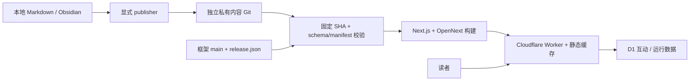

# 当前项目架构

以 ADR 0004 定义的 v1 发行范围为准。

| 模块 | 职责与边界 |
| --- | --- |
| `src/app` | 页面、只读正文 API、动态互动 API |
| `src/lib/posts.ts`, `snippets.ts`, `contentSnapshot.ts` | 开发读取文件；生产读取编译进产物的固定快照，不回退 D1 正文 |
| `src/content/schema.ts`, `scripts/content-contract.cjs` | v1 合同与发布门禁；构建前强制完整验证 |
| `src/middleware.ts`, `contentRegistry.ts` | registry 的 canonical、历史 308、撤稿 410；middleware 直接使用构建快照 |
| `searchSnapshot.ts`, `/content/[digest]/search.json` | 搜索内容摘要寻址；仅摘要端点 immutable，浮动端点 no-store |
| `public/assets` | verified 内容资产的构建输出，Git 忽略 |
| `src/lib/access.ts`, `adminPassword.ts` | 生产 Access JWT 验证、默认关闭；本地开发 HMAC 会话；写请求 Origin/CSRF |
| `rateLimit.ts`, `mutation.ts`, `publicIdentity.ts` | D1 共享限流、Turnstile、独立密钥哈希 actor、幂等互动 |
| `desktop-manager` | 独立作者工作区，v1 文件创建/元数据编辑、revision 检测和恢复历史 |
| `scripts/publish*.cjs` | 明确内容输入、图片 AST 引用闭包、源 hash 二次核对、Git 基线、撤稿摘要确认 |
| `scripts/checkout-content.cjs`, `generate-content-snapshot.cjs` | 固定独立内容 SHA、严格验证和生成生产快照 |
| `scripts/seal-release.cjs` | 源码/产物摘要封存与部署前校验 |
| `.github/workflows/deploy.yml`, `deploy.ps1` | 无条件 CI 检查，手动串行发行，同一构建产物与公网烟测 |
| `schema.sql`, `infra/migrations` | 新环境运行表及旧环境逐步迁移；旧正文表仅留作备份，不参与读取 |
| `src/themes`, `components/theme`, `globals.css` | 现有 Nightowl 主题、排版及切换 |

公开问题记录只投影 id/title/url/platform/status/tags/date，私人 note/analysis 不出现在响应或生成快照。

正文、编辑工作区、发行产物和动态数据有独立生命周期。内容 Git 的变更不会直接改变公网；必须提交新 pin、构建、校验、发行。
